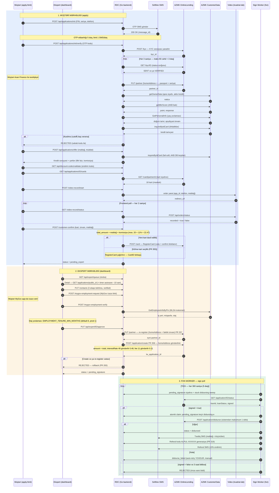
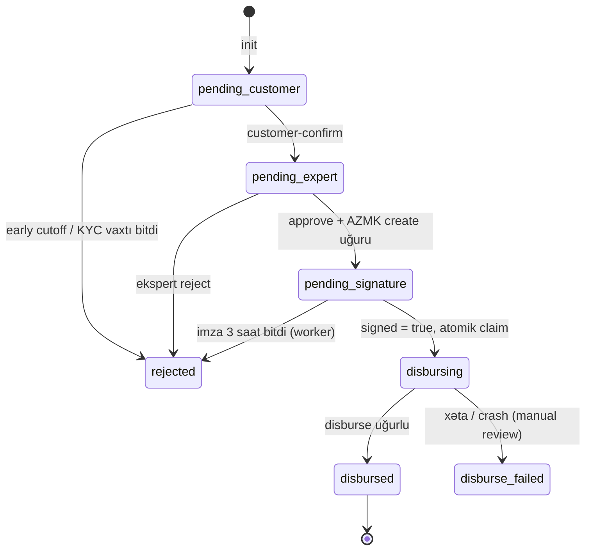

# RDC — Tam Axın (A–Z): Sequence Diagram

> PR #359 — `source/` kod bazası əsasında. Bütün xarici inteqrasiyalar və vaxt
> (poll / timeout / limit) parametrləri diaqramda qeyd olunub.

## Tam axın — sequence diagram

## Status keçidləri

## Xarici inteqrasiyalar

| Servis | Base URL | Əməliyyatlar | Axında yeri | Timeout |
|---|---|---|---|---|
| AZMK OnlineLending | web.azmk.az:7077/.../OnlineLendingService | POST /kyc, GET /kyc/ID, PUT /partner, GET /card/ID, POST /card, POST /application/create, GET /application/ID/status, POST /application/disburse | init/verify, kart, approve, worker | 30 s |
| AZMK CustomerData | web.azmk.az:7077/.../CustomerDataService | GetPersonalInfo, getMkrScore, getOwnerData, inquireByIdCard, GetEmployeeInfoByPin | early cutoff, offer, staj yoxlaması | 30 s |
| Softline SMS | gw.soft-line.az/sendsms | GET sendsms | OTP, təsdiq, referal SMS | — |
| Video servisi | videodemo.kvadrat-lab.com | POST /api/orders, POST /api/orders/status | apply video mərhələsi | — |
| MyGov | konfiqurasiya edilən provider | icazə linki (deeplink), məlumat çəkmə | employment / pension | — |
| LW | LW_BASE_URL (məs. localhost:8080) | personal-info, akb-score, akb-history, asan-finance, sima, blacklist (/api/router/* proxy) | ekspert alətləri, AKB override | 30 s |
| SIMA | mock (dev) | /api/router/sima/init + callback | dev/test | — |
| SQL Server | DB_HOST | əsas DB (loan_applications, cutoff_results, ...) | hər yer | — |

## Vaxt parametrləri

| Parametr | Mənbə (env / kod) | Default | Prod (loqdan) | Təsvir |
|---|---|---|---|---|
| OTP etibarlılığı | OTPCodeTTL (kod) | 300 s | 300 s | OTP kodu 5 dəq çür olur |
| OTP limiti | OTP_RATE_LIMIT_PER_MIN | 1/dəq | 1 | SMS bombaya qarşı |
| API limiti | RATE_LIMIT_PER_MINUTE | 60/dəq | 60 | ümumi API |
| Endirim limiti | DISCOUNT_RATE_PER_MIN | 5/dəq | 5 | discount validate |
| KYC poll | kod (init.go) | 3 s × 60 | — | init/verify içində, maks 3 dəq gözləmə |
| Video status poll | frontend (apply.html, PR 188) | 2 s | — | recorded = true olana qədər |
| Sign worker tick | AZMK_SIGN_POLL_INTERVAL_S | 300 s | 300 s | hər 5 dəq status yoxlanılır |
| İmza timeout | AZMK_SIGN_TIMEOUT_S | 10800 s | 10800 s | 3 saat bitəndə rejected |
| AZMK HTTP | AZMK_TIMEOUT_S | 30 s | 30 s | bütün AZMK çağırışları |
| LW HTTP | LW_TIMEOUT_S | 30 s | 30 s | |
| SMS provider keşi | kod (DB-driven) | 60 s | 1m0s | provider DB-dən 1 dəq keşlənir |
| Auth sessiya | AUTH_SESSION_TTL_HOURS | 8 saat | 8 | ekspert sessiyası |
| Minimum staj | EMPLOYMENT_TENURE_MIN_MONTHS | 6 ay | 1 ay | MLSA staj yoxlaması |
| Timer autosave | frontend (detail.html) | ~10 s | — | ekspert detail səhifəsi |

## AZMK request formuları (əsas)

- **Partner (init):** `PUT /partner` — homeAddress = `-` (müştəri hələ ünvan daxil etməyib), passport = seriya, mobile = +994 siz
- **Partner re-register (approve, PR 357):** homeAddress = dashboard-dakı faktiki ünvan; eyni PIN üçün eyni partner_id qayıdır
- **Application create (PR 358):** `POST /application/create` — homeAddress göndərilmir; amount = total (principal + komissiya); interestRate = illik faiz / 100 (48 → 0.48); disbursementFee = komissiya / 100 (11 → 0.11); cardId = seçilmiş kart
- **Disburse (PR 323):** applicationId + cardId + eyni LoanData; sistemdən maksimum 1 dəfə göndərilir (claim protokolu)
- **SMS (PR 351):** "Sizin %.2f AZN məbləğində kreditiniz təsdiq edildi, kartınıza %.2f AZN köçürüldü." — total + köçürülən principal
- **Referal (PR 319):** disburse uğurundan sonra ALPUL-XXXXXX kodu (10%) + SMS
