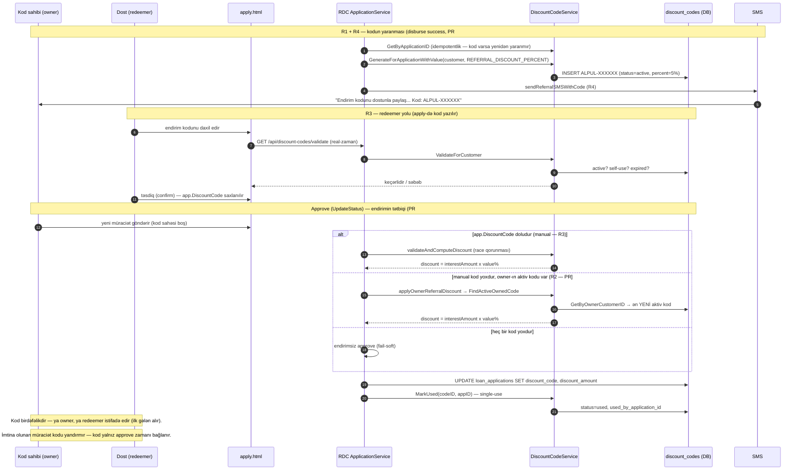

# Pre-Referal Kod Planı (Referal kod sistemi — gələcək implementasiya planı)

> Status: **İMPLEMENTASIYA OLUNDU — R1+R4 (PR #319), R3 (hazır idi), R2 (PR #450)** ·
> Tarix: 2026-08-26 · Müəllif: Zamir ·
> Əlaqəli analiz: 2026-08-26 disburse log analizi (run 1 fee=0 xətası + `sql: no rows` zənciri)

## Məqsəd

Disburse **success** olan hər müştəri üçün onun FIN-ninə bağlı unikal referal kodu
(`ALPUL-XXXXXX`) yaradılsın və DB-də store edilsin. Bu kod iki benefit verir:

1. **Kod sahibi (owner):** növbəti kredit səviyyəsinə (level) adladıqda
   parametrik təyin olunmuş faiz endirimi alır.
2. **Kod istifadəçisi (redeemer):** kodu `apply.html`-də yazan yeni müştəri də
   faiz endirimi alır.

Hər iki benefit implementasiya olunub: redeemer (R3) kodu `apply.html`-də yazaraq,
owner (R2, PR #450) isə növbəti kreditinin approvunda endirimi **avtomatik** alır.

## Ardıcıllıq sxemi (sequence diagram)

## Arxaplan — mövcud infrastruktur (yenidən qurulmur, tamamlanır)

- `discount_codes` cədvəli (migration 023/024): `issued_to_customer_id` (owner FK),
  `discount_type` (`percent`|`fixed`) + `discount_value` (per-code parametrik),
  status (`active|used|expired`), single-use (`used_by_application_id`), `valid_until`
- `internal/service/discount_code_service.go`: `GenerateForApplication` (kod
  kolliziyasında retry), `ValidateForCustomer` (self-use prevention, PR #94),
  `CalculateDiscount` (faiz məbləğindən hesablanır), `MarkUsed`
- `web/apply.html`: endirim kodu input-u + live validasiya (PR #96/#106) —
  redeemer tərəf hazırdır
- Config: `REFERRAL_DISCOUNT_PERCENT` (default 5, `config/config.go`) +
  `sendReferralSMSOnDisburse` (PR #284, `application_service_status.go`)

## Bilinən prerequisite bug (implementasiya zamanı düzəldilməlidir)

Init axını (`POST /api/applications/init` → `InitApplication`,
`application_service_init.go`) **`customers` row-u yaratmır** — yalnız legacy
`POST /api/applications` axını (`CreateApplication`, `application_service.go`)
`customerRepo.GetOrCreate` çağırır.

Nəticədə init axını ilə gələn müştərilər üçün:

- approve-da `generateAndSendDiscountSMS` → `GetByPIN` → `sql: no rows` →
  kod generasiya olunmur
- disburse-da `sendReferralSMSOnDisburse` → `GetByApplicationID` →
  `sql: no rows` → referal SMS getmir

Yəni hazırda init axını ilə gələn heç bir müştəri üçün referal/endirim kodu
feature-u işləmir (disburse-a təsiri yoxdur — non-fatal).

## Tələblər

### R1 — Kod generasiyası disburse success-da (əsas dəyişiklik)

- Kod approve zamanı yox, **disburse success** zamanı generasiya olunsun
  (yalnız icra olunan (faktiki verilən) kredit referal hüququ qazandırır)
- `customers` row-u yoxdursa `GetOrCreate` ilə yaradılsın (init axını fix-i)
- Kod FIN-ə bağlansın: `issued_to_customer_id` = `customers.id`
- Generasiya zamanı `discount_value` = `REFERRAL_DISCOUNT_PERCENT`-dən götürülünsün
  (parametrik; per-code `discount_type` = `percent`)
- İdempotentlik: eyni application üçün ikinci kod yaranmasın
  (`GetByApplicationID` mövcuddursa skip)

### R2 — Owner benefit: növbəti level endirimi (PR #450 ilə implementasiya olundu)

- Kod sahibi növbəti credit level-ə adladıqda (mövcud `credit_levels` /
  `CountApprovedAtLevel` / unlockPhase mexanizmi) faiz endirimi avtomatik
  tətbiq olunsun
- Endirim faizi kodun `discount_value` sahəsindən (per-code) götürülür
- Endirim yalnız aktiv (`active` statuslu) koda görə verilsin; istifadə olunanda
  `used` olaraq işarələnsin

### R3 — Redeemer benefit: apply.html (mövcuddur, sənədləşdirilir)

- Yeni müştəri kodu `apply.html`-də daxil edir → `ValidateForCustomer`
  (self-use prevention, single-use) → faiz məbləğindən endirim hesablanır
  (`CalculateDiscount(dc, interestAmount)`)
- Təsdiq zamanı kod `MarkUsed` ilə bağlanır

### R4 — SMS (mexanizm hazırdır, amma kodun mənbəyi R1-ə asılıdır)

- Disburse success-dan sonra owner-ə referal SMS göndərilir
  (`sendReferralSMSOnDisburse`, PR #284) — transport/şablon/göndərilmə hazırdır
- **SMS-in içindəki kodun mənbəyi** (R1↔R4 sərhədi):
  - hazırda: `GetByApplicationID(ctx, app.ID)` — approve zamanı generasiya
    olunmuş kodu DB-dən oxuyur (bug-a görə `sql: no rows` ilə nəticələnir)
  - yeni planda iki variant:
    - **(a) tövsiyə olunur:** R1-in `GenerateForApplication` çağırışı qaytardığı
    kod obyektini birbaşa SMS addımına ötürmək — əlavə DB oxuması yoxdur
    - (b) R1 generasiyasından dərhal sonra `GetByApplicationID` ilə oxumaq —
    hazırdakı mexanizm qalır, sadəcə generasiya vaxtı dəyişir
- **Sıralama kritikdir:** R1 (generasiya) → R4 (SMS). Funksiyadakı
  "Approve zamanı generasiya olunmuş kodu tap" şərhi/məntiqi R1 ilə birgə
  yenilənməlidir

## Qəbul meyarları

- [ ] Init axını ilə yaradılmış application disburse olanda `customers` row-u
      avtomatik yaranır (FIN + phone + full_name)
- [ ] Disburse success → `discount_codes`-da FIN-ə bağlı `active` kod yaranır,
      dəyəri `REFERRAL_DISCOUNT_PERCENT`-ə bərabərdir
- [ ] Təkrar disburse/disburse-status poll kodu dublikat yaratmır
- [ ] Referal SMS-də göndərilən kod R1-də generasiya olunan (store olunmuş)
      kodla eynidir — SMS generasiyadan SONRA göndərilir
- [ ] Owner növbəti levelə adlayanda endirim tətbiq olunur (R2)
- [ ] Başqa müştəri kodu apply.html-də yazanda endirim alır, kod `used` olur
- [ ] Owner öz kodunu istifadə edə bilmir (self-use prevention qalır)
- [ ] Bütün addımlar non-fatal: referal xətaları disburse-u pozmur
- [ ] `sql: no rows` ERROR logları müşahidə olunmur

## Texniki qeydlər

- Kod generasiyası `sendReferralSMSOnDisburse` çağrılan yerdə (disburse success
  handler, `application_service_status.go` / PR #312 sign worker auto-disburse
  yolu) `GenerateForApplication`-a əsaslanır
- Init axınında `customers` row: `InitApplication` və ya
  `CustomerConfirmApplication` (full_name/phone artıq məlum olur) —
  `GetOrCreate` + `LinkApplication`
- Migration lazım deyil — mövcud sxem (`discount_codes`, FK-lər) kifayət edir

## Əlaqəli

- PR #94 (discount infrastruktur), PR #96/#106 (apply.html input),
  PR #284 (referal SMS disburse-da), PR #312 (sign worker / auto-disburse)
- `migrations/023_discount_codes.sql`, `migrations/024_discount_codes_nullable_issued_from.sql`
- `Docs/PR93_Discount_Code_Plan.md` (migration şərhində istinad olunur)
